# Li-ion Battery Electrical Modeling

### Simulation background

The purpose of this project was to model the electrical behavior of the battery that our team uses (Aristotle University Racing Team Electric - ARISTURTLE). Modeling of the battery requires the calculation of the state of charge of the cells and the knowlegde of the cells' voltages for various currents amplitudes. In parallel, during this process, we took into consideration the variations in the cell capacitance, energy and internal resistance.

For the modeling of the battery, we used the equivalent electrical circuit that is shown below.

The capacitor C_batt indicates the capacitance that is saved in the cell and the dependant current source indicates the amplitude of the current that charges or discharges the battery. Thus, the left circuit simulates the state of charge (SOC) of the battery, which changes dynamically and depends on the values of the parameters of the right circuit.

The right circuit consists of dependant voltage source which depends on the SOC and indicates the open-circuit voltage of the circuit. Then, there is a resistor in series R_series which indicates the internal resistance of the cell and there are some parallel RC branches that simulate the transient behavior of the cell, which happens due to the pollarization inside the cell.

Those parameters depend on the SOC, the temperature and possibly by the charge/discharge current.

The accuracy of the modeling depends a lot by the number of parallel RC branches that we use. It has been proof that for the simulation of the transient response of the cell, it is needed at least, 3+3 RC branches (3 charge transfer polarization and 3 diffusion polarization). The more RC branches we use, the more complex and computational-intence becomes the modeling process.

The program we used for the simulation of the battery cells was Matlab/Simulink of Mathworks. Below, you can see the models we 2 RC branches. The inpouts of the model are the current (if positive, it means discharging and if negative, it means charging) and the initial capacitance of the cell. The outputs are the voltage of the cell, the providing energy and the SOC of the cell.

Following, it is presented the calculations of the model.

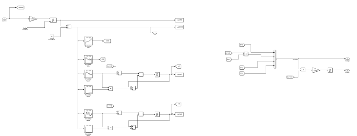
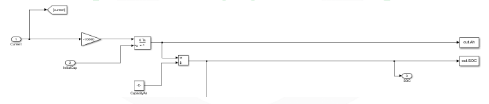
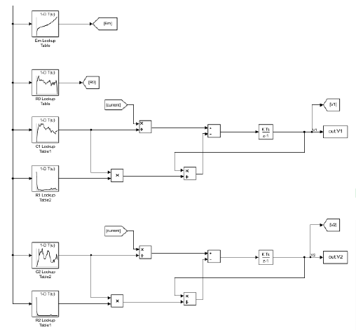
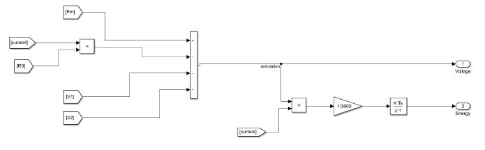

In order to find the parameters of the equivalent electrical circuit in LUT form, we used an algorithm from the libraries of MathWorks, called "Example_DischargePulseEstimation" (Matlab->toolbox->autoblks->autodemos). This algorithm takes as inputs data of cell discharge experimetns and by using curve fitting methods and calculates the open-circuit voltage, series resistance and RC branches with respect to the SOC. Those values are, then, assigned in the block Estimation equivalent circuit and Equivalent circuit battery library of MathWorks.

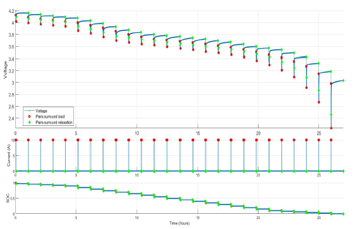
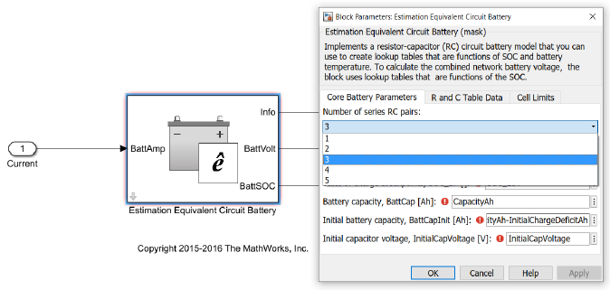
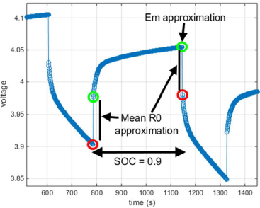
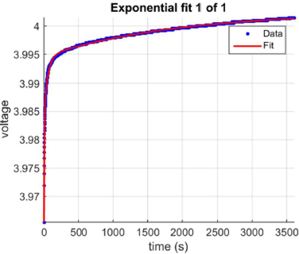

### Experiments

For the first experiments we used cylindrical Li-ion cells (18650). The purpose was to check the function of the experimental circuits. Below, it is shown the experimental circuits that we used in order to simulate the cell load and read the voltage values and store them.

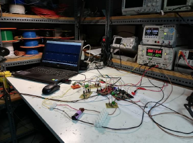

Below, we present the results

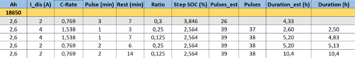

Then we used the old battery cells that our team used in our electric vehicle

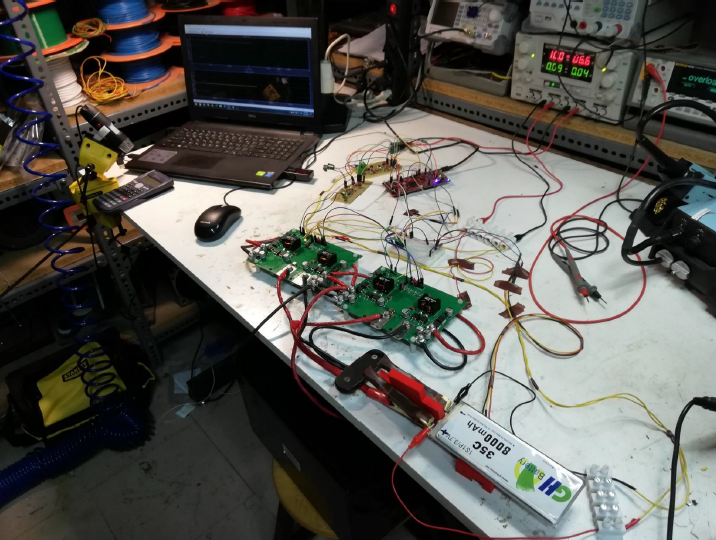

Below, we present the results

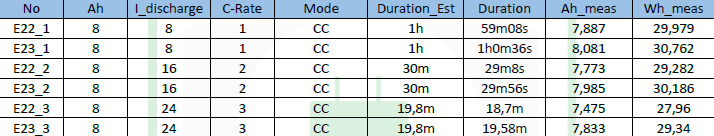

